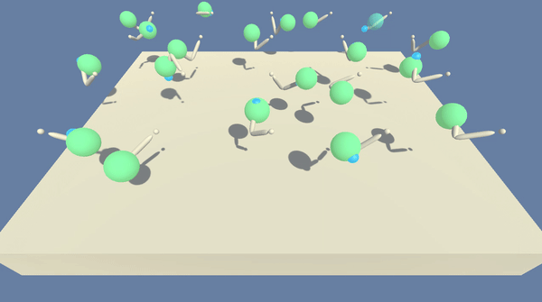

# Arm Continuous Control
PPO (Proximal Policy Optimization)

### Introduction

In this project, a double-jointed arm is trained to reach target locations. A reward of +0.1 is provided for each step that the agent's hand is in the goal location. Thus, the goal is to maintain position at the target location for as many time steps as possible.

The environment is considered solved, when the 20 agents in this environment get an average score of +30 (over 100 consecutive episodes, and over all agents).  Specifically,
- After each episode, the rewards are added up that each agent received (without discounting), to get a score for each agent.  This yields 20 (potentially different) scores. The average of these 20 scores is taken. 
- This yields an **average score** for each episode (where the average is over all 20 agents).

#### State-Action Represenation

- Observation space type: continuous
    - Observation space size (per agent): 33, corresponding to:
        - position, rotation, velocity, and angular velocities of the arms
- Action space type: discrete
    - Action space size (per agent): 4, corresponding to:
        - 0: torque_x applied to the 1st joint 
        - 1: torque_z applied to the 1st joint 
        - 2: torque_x applied to the 2nd joint 
        - 3: torque_z applied to the 2nd joint

### Getting Started

1. conda create --name reacher python=3.6
2. conda activate reacher
3. conda install jupyter
4. pip install gym
   (make sure that pip is acting in your environment "type pip")
5. conda install pytorch=0.4.0 -c pytorch
6. cd C:\Users\YOUR_USERNAME\Documents\GitHub\Arm-Continuous-Control\python
7. pip install .
8. install XQuartz from here: https://www.xquartz.org
   (remember to restart your mac)
9. Download the pre-compiled Unity Environment to "data" folder (20 Agents):
    - Linux: [click here](https://s3-us-west-1.amazonaws.com/udacity-drlnd/P2/Reacher/Reacher_Linux.zip)
    - Mac OSX: [click here](https://s3-us-west-1.amazonaws.com/udacity-drlnd/P2/Reacher/Reacher.app.zip)
    - Windows (32-bit): [click here](https://s3-us-west-1.amazonaws.com/udacity-drlnd/P2/Reacher/Reacher_Windows_x86.zip)
    - Windows (64-bit): [click here](https://s3-us-west-1.amazonaws.com/udacity-drlnd/P2/Reacher/Reacher_Windows_x86_64.zip)
    10. Follow the instructions in `reacher.ipynb` to get started!