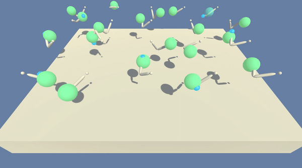
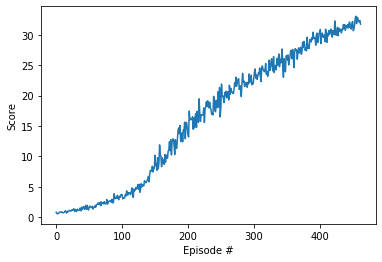

# Arm Continuous Control
PPO (Proximal Policy Optimization)



### Introduction

In this project, a double-jointed arm is trained to reach target locations. A reward of +0.1 is provided for each step that the agent's hand is in the goal location. Thus, the goal is to maintain position at the target location for as many time steps as possible.

The environment is considered solved, when the 20 agents in this environment get an average score of +30 (over 100 consecutive episodes, and over all agents).  Specifically,
- After each episode, the rewards are added up that each agent received (without discounting), to get a score for each agent.  This yields 20 (potentially different) scores. The average of these 20 scores is taken. 
- This yields an **average score** for each episode (where the average is over all 20 agents).

#### State-Action Represenation

- Observation space type: continuous
    - Observation space size (per agent): 33, corresponding to:
        - position, rotation, velocity, and angular velocities of the arms
- Action space type: discrete
    - Action space size (per agent): 4, corresponding to:
        - 0: torque_x applied to the 1st joint 
        - 1: torque_z applied to the 1st joint 
        - 2: torque_x applied to the 2nd joint 
        - 3: torque_z applied to the 2nd joint


### Learning Algorithm
In recent years, several different approaches have been proposed for reinforcement learning with neural network function approximators. The leading contenders are deepQ-learning,'vanilla' policy gradient methods, and trust region / natural policy gradient methods. Q-learning (with function approximation) fails on many simple problems, vanilla policy gradient methods have poor robustness;  and  trust  region  policy  optimization  (TRPO) is not compatible with architectures that include noise (such as dropout) or parameter sharing (between the policy and value function, or with auxiliary tasks). For this project, proximal policy optimization is used, it uses multiple epochs of stochastic gradient ascent to perform each policy update. This methods have the stability and reliability of trust-region methods but are much simpler to implement, requiring only few lines of code change to a vanilla policy gradient implementation.[Schulman et al](https://arxiv.org/abs/1707.06347)

PPO calculates gradient based on the policy likelihood ratio between old and new policy, and leverages ratio clipping to avoid gradient explosion. GAE (Generalized Advantage Estimation) method was used to estimate the advantage function.


### Result & Plot of Rewards
The environment was solved in under 463 episodes.

```bash
Episode: 10, average score: 0.74
Episode: 20, average score: 0.79
Episode: 30, average score: 0.91
Episode: 40, average score: 0.99
Episode: 50, average score: 1.10
Episode: 60, average score: 1.19
Episode: 70, average score: 1.33
Episode: 80, average score: 1.45
Episode: 90, average score: 1.60
Episode: 100, average score: 1.77
Episode: 110, average score: 2.05
Episode: 120, average score: 2.38
Episode: 130, average score: 2.75
Episode: 140, average score: 3.18
Episode: 150, average score: 3.78
Episode: 160, average score: 4.55
Episode: 170, average score: 5.28
Episode: 180, average score: 6.23
Episode: 190, average score: 7.24
Episode: 200, average score: 8.33
Episode: 210, average score: 9.54
Episode: 220, average score: 10.78
Episode: 230, average score: 12.04
Episode: 240, average score: 13.28
Episode: 250, average score: 14.40
Episode: 260, average score: 15.45
Episode: 270, average score: 16.57
Episode: 280, average score: 17.58
Episode: 290, average score: 18.48
Episode: 300, average score: 19.28
Episode: 310, average score: 20.08
Episode: 320, average score: 20.83
Episode: 330, average score: 21.55
Episode: 340, average score: 22.27
Episode: 350, average score: 22.94
Episode: 360, average score: 23.60
Episode: 370, average score: 24.23
Episode: 380, average score: 24.83
Episode: 390, average score: 25.51
Episode: 400, average score: 26.23
Episode: 410, average score: 26.87
Episode: 420, average score: 27.48
Episode: 430, average score: 28.09
Episode: 440, average score: 28.66
Episode: 450, average score: 29.28
Episode: 460, average score: 29.84
Environment solved in 463 episodes!	Average Score: 30.02
Average Score: 30.02
Elapsed time: 1:08:33.381600
Saving checkpoint!
```

The following figure illustrates the average score over time obtained during training:



The model was evaluated after training by loading `checkpoint.pth`, and running the environment in evaluation mode (i.e. `train_mode=False`):

```bash
Episode: 1, score: 31.514999295584857
Episode: 2, score: 31.991499284934253
Episode: 3, score: 32.324832610817005
Episode: 4, score: 32.35762427675073
Episode: 5, score: 32.52949927290902
Episode: 6, score: 32.232415946216015
Episode: 7, score: 32.204713565882834
Episode: 8, score: 32.191436780465295
Episode: 9, score: 32.14727705923012
Episode: 10, score: 32.136749281687656
```

### Network Architecture
An actor-critic structure with continuous action space was used for this project. The policy consists of 3 parts, a shared hidden layers, actor, and critic.
The actor layer outputs the mean value of a normal distribution, from which the agent's action is sampled. The critic layer yields the value function.

- Shared layer:
```
Input State(33) -> Dense(128) -> LeakyReLU -> Dense(128) -> LeakyReLU*
```
- Actor and Critic layers:
```
LeakyRelu* -> Dense(64) -> LeakyRelu -> Dense(4)-> tanh -> Actor's output
LeakyReLU* -> Dense(64) -> LeakyRelu -> Dense(1) -> Critic's output
```

#### Model update using PPO/GAE
The hyperparameters used during training are:

Parameter | Value | Description
------------ | ------------- | -------------
Number of Agents | 20 | Number of agents trained simultaneously
Episodes | 2000 | Maximum number of training episodes
tmax | 1000 | Maximum number of steps per episode
Epochs | 10 | Number of training epoch per batch sampling
Batch size | 128*20 | Size of batch taken from the accumulated  trajectories
Discount (gamma) | 0.995 | Discount rate 
Epsilon | 0.05 | Ratio used to clip r = new_probs/old_probs during training
Gradient clip | 10.0 | Maximum gradient norm 
Beta | 0.01 | Entropy coefficient 
Tau | 0.95 | tau coefficient in GAE
Learning rate | 2e-4 | Learning rate 
Optimizer | Adam | Optimization method

### Future Work
1. Hyperparameter optimization and analysis.
2. Studying the effect of clipping.
